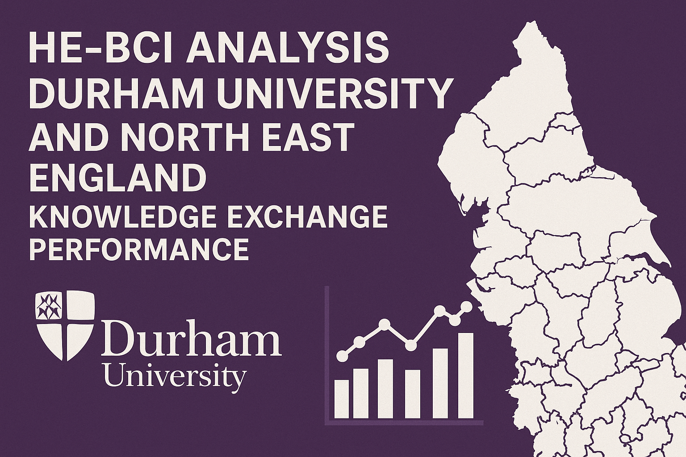

# HE-BCI Data Analysis Project: Durham University and North East England Knowledge Exchange Performance Analysis



**📄 Report Format**: The project report is completed in LaTeX format and stored in `@report/report_latex/`. For quick viewing, download this folder, compress it to ZIP format, and upload it to [Overleaf](https://www.overleaf.com/) for online compilation and viewing.

## Project Overview

This project conducts an in-depth analysis of **Higher Education Business and Community Interaction (HE-BCI)** data, focusing on **Durham University** and the **North East England region** knowledge exchange performance assessment. The project employs a comprehensive analytical approach across five dimensions: income, intellectual property, public engagement, regional positioning, and trend prediction, providing data-driven decision support for university strategic planning.

## 🎯 Project Objectives

- **Evaluate the effectiveness and impact** of knowledge exchange activities
- **Identify regional patterns and trends** in university-business interactions
- **Assess Durham University's performance** against regional and national benchmarks
- **Provide strategic insights** to enhance knowledge exchange strategies
- **Drive economic growth and innovation**, supporting regional development

## 📊 Analytical Framework

The project adopts a **five-dimensional analytical framework** ensuring comprehensive coverage of all aspects of knowledge exchange:

### 1. Income Analysis
- Collaborative research income analysis
- Business services income analysis
- CPD and continuing education income
- Regeneration and development project income
- Regional and national ranking comparisons

### 2. Intellectual Property Analysis
- IP disclosures and patent analysis
- Licensing activity assessment
- IP-related income analysis
- Spin-off company performance
- Commercialization efficiency evaluation

### 3. Public Engagement Analysis
- Social and cultural activity analysis
- Community engagement initiative assessment
- Public participation metrics
- Academic staff involvement analysis
- Event type and nature distribution

### 4. Regional & Specialization Analysis
- University ranking comparison analysis
- Specialization trend identification (HHI index)
- Competitive positioning assessment
- Regional leadership analysis
- Correlation matrix analysis

### 5. Trend Prediction Analysis
- Multi-model prediction (5 algorithms)
- Time series analysis
- Clustering analysis
- Future development trend forecasting
- Strategic opportunity identification

## 🗂️ Dataset Description

### Data Source
- **HE-BCI Survey**: Established in 1999, annual survey by [Higher Education Statistics Agency (HESA)](https://www.hesa.ac.uk/data-and-analysis/business-community)
- **Time Span**: 2014/15 to 2023/24 academic years (10 years)
- **Institution Coverage**: 228 UK higher education institutions
- **North East Institutions**: 5 (Durham, Newcastle, Northumbria, Sunderland, Teesside)

### Data Table Structure
| Table | Content Description | Key Metrics |
|-------|-------------------|-------------|
| Table 1 | Collaborative Research Income | Funding sources, income types, public funding |
| Table 2a | Business and Community Services | Service types, organization types, value/quantity |
| Table 2b | CPD and Continuing Education | Course categories, learner days, income |
| Table 3 | Regeneration and Development | Project types, funding sources, income |
| Table 4a | IP Disclosures and Patents | Disclosure types, patent applications, patent grants |
| Table 4b | License Numbers | License types, organization types, income generation |
| Table 4c | IP Income Sources | Income sources, organization types, income amounts |
| Table 4d | Total IP Income | Annual total IP income |
| Table 4e | Spin-out Activities | Company metrics, employment, turnover, investment |
| Table 5 | Social and Cultural Engagement | Activity types, participants, academic time |

## 🛠️ Technical Implementation

### Programming Language
- **Python 3.10+**: Primary analysis language
- **Jupyter Notebook**: Interactive analysis environment

### Core Dependencies
```python
# Data processing
pandas>=1.5.0
numpy>=1.21.0

# Data visualization
matplotlib>=3.5.0
seaborn>=0.11.0

# Machine learning
scikit-learn>=1.1.0
xgboost>=1.6.0

# Time series analysis
statsmodels>=0.13.0
pmdarima>=2.0.0

# Statistical analysis
scipy>=1.9.0
```

### Project Structure
```
HE-BCI_Analysis/
├── Data/                          # Raw data files
│   ├── table-1.csv               # Collaborative research income data
│   ├── table-2a.csv              # Business services data
│   ├── table-2b.csv              # CPD and continuing education data
│   ├── table-3.csv               # Regeneration and development data
│   ├── table-4a.csv              # IP disclosures and patents data
│   ├── table-4b.csv              # License data
│   ├── table-4c.csv              # IP income sources data
│   ├── table-4d.csv              # Total IP income data
│   ├── table-4e.csv              # Spin-out companies data
│   └── table-5.csv               # Public engagement data
├── Sample_Data_in_NE/             # Sample data for North East region
├── visualizations/                # Generated visualization charts
│   ├── data_exploratory/         # Data exploratory analysis charts
│   ├── income_analysis/          # Income analysis charts
│   ├── ip_analysis/              # IP analysis charts
│   ├── public_engagement/        # Public engagement charts
│   ├── regional_analysis/        # Regional analysis charts
│   ├── performance_efficiency/   # Performance efficiency charts
│   ├── resilience_risk/          # Resilience and risk charts
│   └── trend_prediction/         # Trend prediction charts
├── report/                        # Project reports
│   └── report_latex/             # LaTeX report source files
├── 1.data_exploratory_analysis.py    # Data exploratory analysis
├── 2.income_analysis.py              # Income analysis
├── 3.ip_analysis.py                  # Intellectual property analysis
├── 4.public_engagement_analysis.py   # Public engagement analysis
├── 5.extral_regional_analysis.py     # Regional analysis
├── 6.performance_efficiency_analysis.py # Performance efficiency analysis
├── 7.resilience_risk_analysis.py     # Resilience and risk analysis
├── 8.trend_prediction.py             # Trend prediction analysis
├── requirements.txt                   # Python dependencies
├── README.md                         # Project documentation
└── topic_image.png                   # Project cover image
```

## 🚀 Quick Start

### Requirements
- Python 3.10+

### Installation Steps
```bash
# 1. Clone the project
git clone https://github.com/xvsfvv/HE-BCI-Analysis-Project.git
cd HE-BCI_Analysis

# 2. Create virtual environment
python -m venv venv
source venv/bin/activate  # Linux/Mac
# or
venv\Scripts\activate     # Windows

# 3. Install dependencies
pip install -r requirements.txt

# 4. Run analysis scripts
python 1.data_exploratory_analysis.py
python 2.income_analysis.py
python 3.ip_analysis.py
python 4.public_engagement_analysis.py
python 5.extral_regional_analysis.py
python 6.performance_efficiency_analysis.py
python 7.resilience_risk_analysis.py
python 8.trend_prediction.py
```

## 📈 Key Findings

### Durham University Performance Highlights
- **Research Income**: £639,706, national ranking 33/227, exceeding national average by £255,512
- **IP Disclosures**: 3,458 items, national ranking 28/228, patent portfolio of 2,019 patents
- **Spin-out Companies**: 642 active companies, employing 5,455 staff, turnover £542.35 million
- **Public Engagement**: 6,043,792 activities, 72.1% free, 6,024,744 participants

### Regional Positioning
- **North East Ranking**: Second place in most indicators, behind Newcastle University
- **Specialization Index**: Research HHI=0.28-0.31 (good diversification)
- **Competitive Advantages**: Outstanding performance in research and public engagement

### Improvement Opportunities
- **IP Commercialization**: Only 1.7% of licenses generate income, commercialization efficiency needs improvement
- **CPD Income**: High learner days but low income, pricing strategy needs optimization
- **Business Services**: High income volatility (CV=0.380), diversification strategy needed

## 🔮 Trend Predictions

### Future Development Trends
- **Research Income**: Predicted growth of 25.70%-27.04%
- **CPD Income**: Predicted growth of 39.28%
- **IP Disclosures**: Predicted growth of 50.49%
- **Business Income**: Predicted decline of 31.56%-54.84% (attention needed)

### Prediction Models
The project employs **five advanced prediction models**:
1. **Linear Regression**: Captures long-term linear trends
2. **Exponential Smoothing**: Adapts to recent changes, short-term forecasting
3. **Random Forest**: Handles non-linear relationships, provides uncertainty estimates
4. **ARIMA**: Models autocorrelation and seasonal patterns
5. **XGBoost**: Handles complex interactions, high-accuracy non-linear trends

## 📊 Visualization Output

The project generates **40+ high-quality charts** covering:
- Income distribution and trend charts
- IP activity radar charts and comparison charts
- Public engagement activity distribution charts
- Regional ranking change charts
- Efficiency comparison and trend charts
- Risk volatility analysis charts
- Prediction results and clustering analysis charts

## 📋 Analysis Scripts Description

### 1. Data Exploratory Analysis (1.data_exploratory_analysis.py)
- Dataset overview and structure analysis
- Missing value patterns and distribution analysis
- Regional distribution and institutional trend visualization
- Data quality assessment report

### 2. Income Analysis (2.income_analysis.py)
- Collaborative research income sources and type analysis
- Business services portfolio and client distribution
- CPD and continuing education activity analysis
- Regeneration and development project income analysis
- North East universities income comparison

### 3. Intellectual Property Analysis (3.ip_analysis.py)
- IP disclosure types and time trends
- Licensing activity and income generation analysis
- IP income sources and client types
- Spin-out company performance and impact assessment
- Commercialization efficiency analysis

### 4. Public Engagement Analysis (4.public_engagement_analysis.py)
- Activity nature and type distribution
- Participant numbers and type analysis
- Academic staff time investment assessment
- Community impact and engagement analysis
- Regional comparison and ranking

### 5. Regional Analysis (5.extral_regional_analysis.py)
- Correlation matrix calculation and visualization
- Ranking change trend analysis
- Specialization index (HHI) calculation
- Competitive positioning and advantage analysis
- Regional leadership assessment

### 6. Performance Efficiency Analysis (6.performance_efficiency_analysis.py)
- Research income efficiency (income per academic staff day)
- Business services efficiency assessment
- IP income efficiency analysis
- North East universities efficiency comparison
- National efficiency ranking

### 7. Resilience and Risk Analysis (7.resilience_risk_analysis.py)
- Income volatility calculation (coefficient of variation CV)
- Income concentration analysis (HHI index)
- Risk exposure and vulnerability assessment
- Resilience indicators and ranking
- Risk mitigation strategy recommendations

### 8. Trend Prediction Analysis (8.trend_prediction.py)
- Multi-model time series prediction
- Prediction accuracy and uncertainty assessment
- Clustering analysis (K-means and hierarchical clustering)
- Strategic opportunity identification
- Long-term development planning support

## 📚 Methodology

### Analytical Framework
The project employs a **systematic analytical framework**:
1. **Descriptive Analysis**: Establishes baseline performance metrics
2. **Comparative Analysis**: Benchmarks against regional peers and national standards
3. **Efficiency Analysis**: Evaluates resource utilization and output generation effectiveness
4. **Risk and Resilience Analysis**: Assesses financial stability and vulnerability to external shocks
5. **Predictive Analysis**: Forecasts future trends and identifies strategic opportunities

### Statistical Methods
- **Descriptive Statistics**: Mean, median, standard deviation, coefficient of variation
- **Efficiency Metrics**: Output/input ratios, output per unit resource
- **Risk Metrics**: Coefficient of variation (CV), Herfindahl-Hirschman Index (HHI)
- **Prediction Models**: Linear regression, time series analysis, machine learning algorithms
- **Clustering Analysis**: Unsupervised learning, institutional grouping and pattern recognition

### Data Preprocessing
- **Missing Value Handling**: Zero-filling strategy (based on business logic)
- **Data Cleaning**: Column name standardization, data type conversion
- **Time Series Conversion**: Academic year data conversion to numerical time series
- **Outlier Handling**: Identification and processing of extreme values

## 🔗 Repository Information

- **GitHub Repository**: [https://github.com/xvsfvv/HE-BCI-Analysis-Project](https://github.com/xvsfvv/HE-BCI-Analysis-Project)
- **Data Source**: [HESA HE-BCI Survey](https://www.hesa.ac.uk/data-and-analysis/business-community)
- **Project Status**: ✅ Completed
- **Last Updated**: December 2024
- **Version**: 1.0.0

## 🙏 Acknowledgments

Thanks to the following institutions and data sources:
- **HESA (Higher Education Statistics Agency)**: Providing [HE-BCI survey data](https://www.hesa.ac.uk/data-and-analysis/business-community)
- **Durham University**: Project research subject and partner
- **North East England Higher Education Institutions**: Providing regional comparison data

---

**Note**: This project is part of academic research on higher education knowledge exchange performance. For more information about the HE-BCI survey methodology and data collection, please visit the [official HESA website](https://www.hesa.ac.uk/data-and-analysis/business-community).

